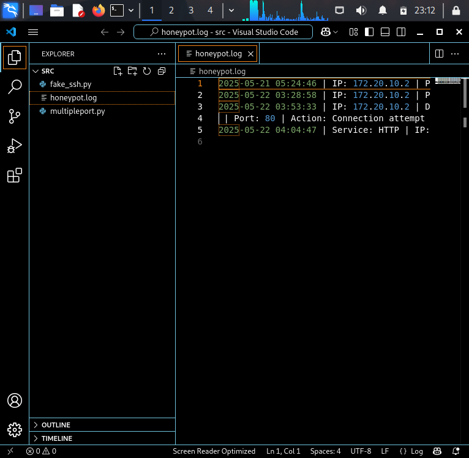

# Honeypot Project
A multi-port deception service detecting unauthorized access attempts.

## Features
- Fake SSH/HTTP/RDP services
- Attack logging with GeoIP
- Real-time Telegram alerts

#The sensitive log files are hidden so a snippet of the logs given below
<p align="center">
  
</p>

## Setup
```bash

#Install required packages
pip3 install -r requirements.txt

#Run the fake SSH honeypot
python3 src/fake_ssh.py
python3 src/multipleport.py


